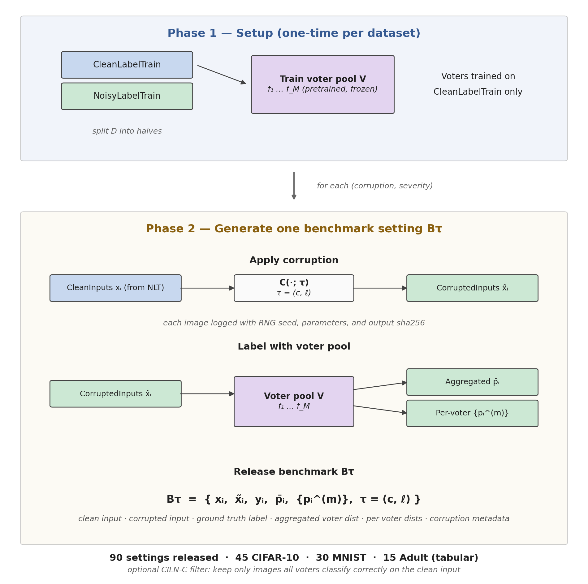

# CILN-Bench

Instance-dependent label noise benchmarks built from controlled input corruptions. Source and severity of the noise are explicit and tunable.



CILN-Bench corrupts inputs first and lets a fixed pretrained voter pool produce the labels. Each dataset is split into a clean-labelled half (used to train the voter pool) and a held-out half that we corrupt. The voters then label the corrupted images, and their disagreement becomes the soft label. Corruption type and severity control where and how much that disagreement happens.

In our ICDE 2027 paper *(link TBA)* we release 90 noisy-label settings across 3 datasets, with per-image reproducibility logs and pre-computed analysis numbers.

| Dataset | Settings released | Voter pool | Noise rate range |
|---|---|---|---|
| CIFAR-10 | 45 | ResNet-20, WRN-28-10, DeiT3-Small, CLIP ViT-B/32 | 8.3% – 75.0% |
| MNIST    | 30 | LeNet-5, MLP, ResNet-20, DeiT3-Small             | 5.9% – 71.5% |
| Adult    | 15 | XGBoost, CatBoost, FT-Transformer, TabPFN, RTDL-MLP | 14.7% – 26.3% |

For each setting we ship: clean input $x_i$, corrupted input $\tilde{x}_i$, ground-truth label $y_i$, aggregated voter distribution $\bar{p}_i$, per-voter distributions $\{p_i^{(m)}\}$, and the corruption metadata $\tau = (c, \ell)$.

---

## Repository layout

```
ciln-bench/
├── README.md
├── requirements.txt
├── run_pipeline.py            # interactive CLI to corrupt your own data
├── code/
│   ├── corrupt/{canonical,public}/
│   └── analyze/{canonical,public}/
├── tests/check_equivalence.py # asserts public == canonical bit-for-bit
├── examples/                  # reproduction scripts (results/ → numbers)
├── results/                   # pre-computed VDV / TV per setting (JSON)
└── docs/{figures,datasets}/
```

### canonical/ vs public/

`canonical/` is the exact code that produced the release. Pure compute on the corruption side: pass in an image and an `rng`, get the same corrupted image back. The analysis side hardcodes a few paths to the original research workspace; a reviewer who wants to bypass `public/` only needs to edit those `Path(...)` constants at the top of each file.

`public/` is the same logic, rewritten clean. Minimal deps, no hardcoded paths, dataset-agnostic where it can be. End-users should use `public/` + `examples/`. `tests/check_equivalence.py` proves `public/` produces the same numbers as `canonical/` bit-for-bit.

---

## Reproducing

**Requirements**

The reproduction scripts run on Python 3.10+. NumPy, pandas, and SciPy are the only required packages. The corruption code in `canonical/` additionally needs OpenCV, scikit-image, Wand (for ImageMagick effects like frost and motion blur), and Pillow. The deeper IDN analyses use PyTorch, CLIP, and scikit-learn. Install everything with:

```bash
pip install -r requirements.txt
```

Before any reproduction, download the relevant release from HuggingFace (see [Datasets](#datasets)) so that you have a folder like `./ciln-bench-cifar10/settings/contrast_sev5/...`.

**Recompute VDV (paper's `nth`) from voter softmaxes**

Loads the per-voter argmaxes, builds the soft labels, computes VDV. Asserts bit-identity against the released numbers for all 45 settings.

```bash
python examples/reproduce_vdv.py --data-root ./ciln-bench-cifar10/settings
```

**Recompute TV vs CIFAR-10H**

TV is bootstrapped (50 resamples per setting), so all 45 takes ~10 min. `--limit N` does just the first N.

```bash
python examples/reproduce_tv.py --data-root ./ciln-bench-cifar10/settings \
                                --cifar10h cifar10h-counts.npy
```

**Downstream accuracy**

Numbers for Co-Teaching, DivideMix, and ERM are not reproducible from the release alone, because they come from training runs that take hours per setting. The trained-model outputs and per-seed logs live in `experiments/downstream/` for inspection.

### Per-image reproducibility

Every corruption uses a seeded random number generator, and we log the seed for every image. Re-run the corruption with the recorded seed and you get back the same pixels. Every released setting ships a `params.jsonl` with one line per image: the seed, the corruption parameters that were sampled, and a SHA-256 of the resulting image. If your re-generated image hashes to the same string, you reproduced ours exactly.

---

## Corrupt your own image

```bash
python run_pipeline.py
```

The script is an interactive CLI. You point it at an `.npy` (images) or `.csv`/`.parquet` (tabular), pick a corruption type and severity, and it writes:

```
out__<setting>/
├── images.npy            # corrupted
├── original.npy          # your input
├── manifest.json         # what was run
└── params.jsonl          # seeds + parameters + sha256 per item
```

Same corruption code as the release, so the output is consistent with the paper.

Image inputs must be square, `uint8`, side ∈ {28, 32, 64, 224}. Tabular inputs auto-detect the label column. Full input contract: [docs/usage.md](docs/usage.md).

---

## Datasets

Per-dataset detail pages:

- [CIFAR-10](docs/datasets/cifar10.md)
- [MNIST](docs/datasets/mnist.md)
- [Adult](docs/datasets/adult.md)

Released datasets (≈3.9 GB) are on HuggingFace, not in git:

- CIFAR-10: *(uploading)*
- MNIST: *(uploading)*
- Adult: *(uploading)*

Each HF dataset has the clean inputs, corrupted inputs, voter softmaxes, aggregated label distributions, ground-truth labels, and per-image reproducibility logs.

---

## A note on metric names

The repo and JSONs call it **VDV** (vote-distribution variance: mean squared L2 distance from each image's vote distribution to its class mean). The ICDE paper calls the same quantity **`nth`** ("Noise Transition Heterogeneity"). Same number.

---

## Citation

```bibtex
@inproceedings{cilnbench2027,
  title  = {CILN-Bench: A Benchmark for Corruption-Induced Label Noise},
  author = {Islam, Shadman and Kristiadi, Agustinus and Milani, Mostafa},
  booktitle = {ICDE},
  year   = {2027}
}
```

## License

MIT.
