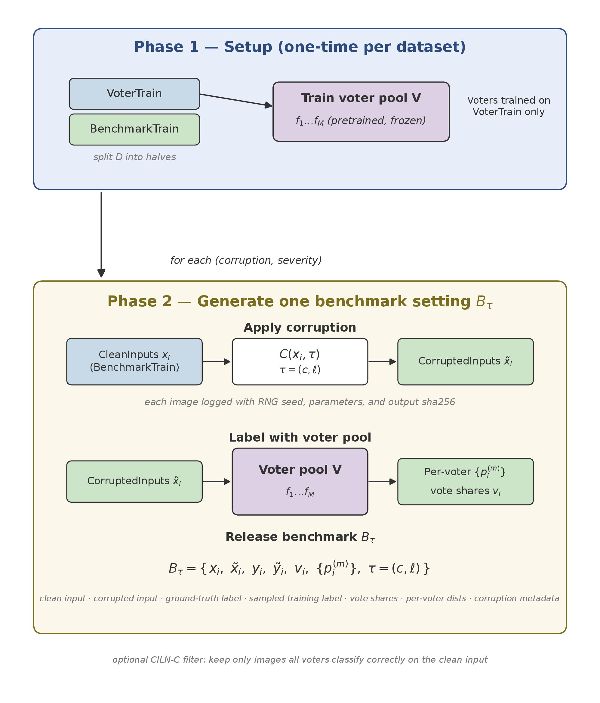

# CILN-Bench

CILN-Bench is a collection of datasets with instance-dependent label noise. Each dataset starts from a clean, correctly labeled dataset. We corrupt the inputs with a chosen corruption type and severity, for example blur on an image or missing values in a table. A fixed pool of trained classifiers, which we call voters, then labels the corrupted inputs. The share of votes each class receives becomes the label distribution of that input. Since each input is corrupted in its own way, the label noise is instance-dependent. Since we control the corruption, the cause and the severity of the noise are known for every example.



## Release

| Dataset | Settings | Voters | Noise rate | Data | Docs |
|---|---|---|---|---|---|
| CIFAR-10 | 45 | 4 | 8.3% to 75.0% | [HF](https://huggingface.co/datasets/sh-islam/ciln-bench-cifar10) | [cifar10.md](docs/datasets/cifar10.md) |
| MNIST | 29 | 4 | 2.5% to 71.5% | [HF](https://huggingface.co/datasets/sh-islam/ciln-bench-mnist) | [mnist.md](docs/datasets/mnist.md) |
| Adult | 15 | 5 | 14.7% to 26.3% | [HF](https://huggingface.co/datasets/sh-islam/ciln-bench-adult) | [adult.md](docs/datasets/adult.md) |
| AG-News | 6 | 4 | 13.0% to 46.6% | [HF](https://huggingface.co/datasets/sh-islam/ciln-bench-agnews) | [agnews.md](docs/datasets/agnews.md) |

Dataset and checkpoint links are redacted for double-blind review and will be restored upon acceptance. All numbers in the paper can be rebuilt from the code and shipped data in this repository (see [docs/reproducing.md](docs/reproducing.md)).

Voter checkpoints: [sh-islam/ciln-bench-voters](https://huggingface.co/sh-islam/ciln-bench-voters). The full list of settings with noise rates is in [`results/released_settings.json`](results/released_settings.json).

Each setting has the clean inputs, the corrupted inputs, the true labels, every voter's softmax, the average softmax, the corruption seed of every row, and the training labels we sampled for the paper. Each dataset also has its clean-start mask and its split index files.

## Quick start

```python
import numpy as np
from huggingface_hub import snapshot_download

local = snapshot_download("sh-islam/ciln-bench-cifar10", repo_type="dataset",
                          allow_patterns=["settings/contrast_sev5/noisy_label_train/*"])
images = np.load(f"{local}/settings/contrast_sev5/noisy_label_train/images.npy")
labels = np.load(f"{local}/settings/contrast_sev5/noisy_label_train/labels.npy")
avg    = np.load(f"{local}/settings/contrast_sev5/noisy_label_train/avg_softmax.npy")
```

## Layout

```
code/       splits, corruptions, voter training, inference, analysis, downstream learners, figure scripts
results/    every number in the paper
logs/       voter training and downstream run logs
docs/       dataset pages, reproducing.md, usage.md
examples/   reproduction scripts
```

[docs/reproducing.md](docs/reproducing.md) shows how to rebuild every number in the paper. `python noisify_dataset.py` corrupts your own data. See [docs/usage.md](docs/usage.md).

MIT license.
